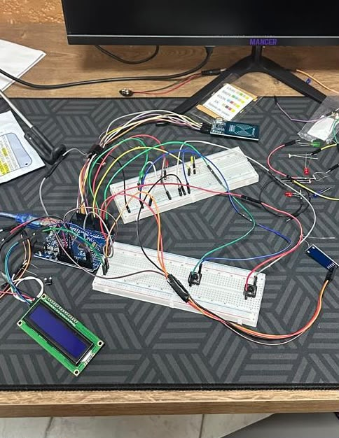
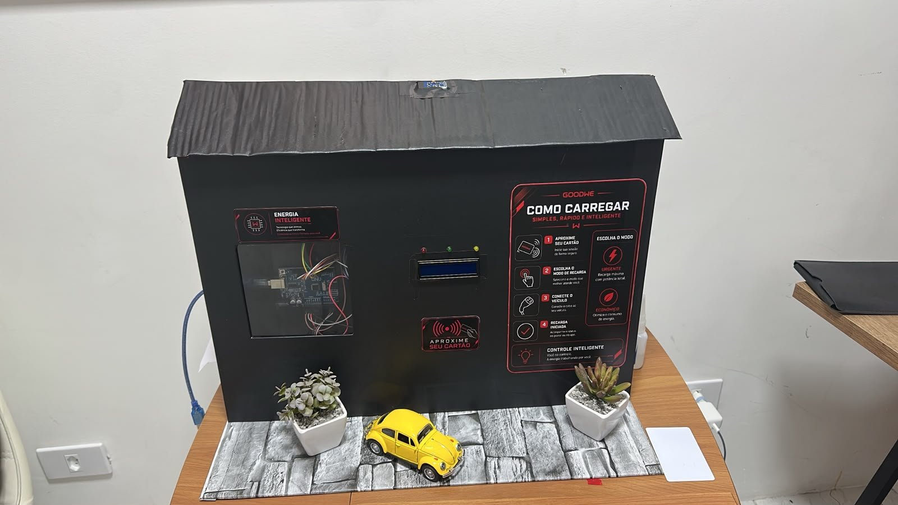
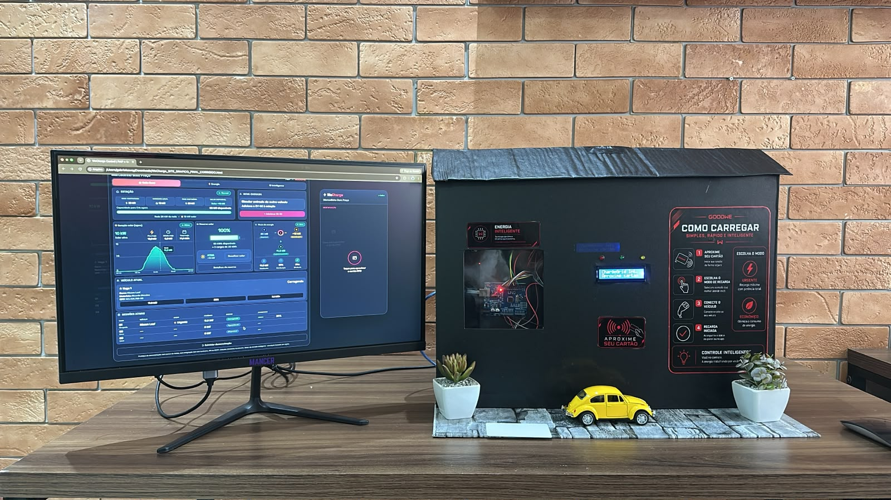

#  WeCharge — Gerenciamento Inteligente de Recarga de Veículos Elétricos

**Desafio GoodWe — FIAP | Sprint 3: Prototipagem Funcional e Integração**

## 1. Título do Projeto

**WeCharge** — plataforma de gerenciamento inteligente da demanda, da recarga e da cobrança para estações de recarga comercial de veículos elétricos, desenvolvida a partir do desafio proposto pela GoodWe.

## 2. Equipe

| Integrante |
|---|
| Victor Vidigal RM 571318 |
| Gabriel Savoy RM 568991 |
| Luigi Borgheti RM 569958 |
| Raphael Tien RM 570261 |

## 3. Contexto e Objetivo

O ponto de partida do projeto foi o ecossistema da GoodWe — suas soluções de energia, carregamento de veículos e monitoramento. A partir dessa pesquisa, o WeCharge foi desenvolvido para complementar o carregador **GoodWe HCA G2** com uma camada de gestão comercial, conectando três pilares centrais:

- **Gerenciamento inteligente da demanda** — controle da potência disponível quando múltiplos veículos carregam simultaneamente;
- **Gerenciamento inteligente da recarga** — priorização e distribuição de energia entre veículos conectados;
- **Cobrança da sessão** — registro e faturamento de cada recarga realizada.

O objetivo é transformar uma solução pensada para recarga residencial em uma solução viável para ambientes comerciais (ex.: estacionamentos, mercados, condomínios), reduzindo a complexidade operacional para o administrador e mantendo uma experiência simples para o usuário final.

## 4. Esquema de Integração dos Componentes

O protótipo integra hardware físico, uma interface web administrativa, uma interface do usuário (mobile) e um motor de decisão em um fluxo único:

O fluxo da recarga acontece, de forma resumida, assim:

- O veículo chega à estação e o cartão RFID (leitor RC522) é aproximado do sensor;
- O Arduino identifica o cartão e envia, pela porta serial (USB, via Web Serial API), o evento de confirmação para o site, liberando automaticamente a etapa de escolha no painel;
- Pelo site (ou pelos dois botões físicos da maquete, que funcionam de forma independente), o usuário escolhe entre **Urgente** ou **Economizar**;
- No modo **Urgente**, o Arduino acende o LED amarelo e aplica a tarifa de R$ 1,79/kWh;
- No modo **Economizar**, o Arduino lê o sensor de luminosidade BH1750 — usado na maquete como um proxy físico e didático da disponibilidade de energia solar: acima de 20 lux, aciona o LED verde (fonte solar, R$ 0,89/kWh); abaixo disso, aciona o LED vermelho (rede, R$ 1,42/kWh);
- Após alguns segundos, os LEDs se apagam e o display LCD passa a mostrar "CARREGANDO", enquanto o Arduino avisa o site de que a recarga está em curso;
- Um comando de reinício, enviado pelo botão "Reiniciar demonstração" do site, devolve toda a maquete ao estado inicial, pronta para uma nova identificação por RFID.

**Imagens do protótipo físico:**

*Montagem do circuito na protoboard, com o Arduino, o leitor RFID, o sensor de luz BH1750, o display LCD e os LEDs de status.*

*Maquete finalizada da estação, com o compartimento do Arduino, o display de status e o passo a passo de "Como carregar" para o usuário.*

*Maquete física integrada em tempo real ao painel administrativo WeCharge Control, exibido no monitor ao lado.*

**Componentes físicos (maquete/protótipo):**
- Arduino UNO com leitor RFID RC522, para identificação do veículo/usuário na entrada da estação;
- Sensor de luminosidade BH1750, usado como proxy físico da disponibilidade de energia solar no modo Economizar;
- Display LCD I2C 16x2, para feedback visual do status da recarga;
- 2 botões físicos (Urgente / Economizar) e 3 LEDs (verde = solar, vermelho = rede, amarelo = urgente);
- Maquete física simulando a estação de recarga, integrada em tempo real à interface web via porta serial (USB).

**Ligações do protótipo físico:**

| Componente | Pinos / Conexão |
|---|---|
| RFID RC522 | SDA → 10, SCK → 13, MOSI → 11, MISO → 12, RST → 9, 3.3V, GND |
| BH1750 (sensor de luz) | SDA → A4, SCL → A5, VCC → 5V, GND |
| LCD I2C | SDA → A4, SCL → A5, 5V, GND |
| Botão Urgente | Pino 2 → botão → GND |
| Botão Economizar | Pino 3 → botão → GND |
| LED Solar (verde) | Pino 5 → resistor 220Ω → LED → GND |
| LED Rede (vermelho) | Pino 6 → resistor 220Ω → LED → GND |
| LED Urgente (amarelo) | Pino 7 → resistor 220Ω → LED → GND |

**Componentes de software:**
- **WeCharge Control** (painel administrativo web): visão geral da estação, geração solar, reserva de energia, fluxo de energia e simulação de chegada de novos veículos;
- **App do usuário** (interface mobile): autenticação via RFID, escolha de kWh e modo de prioridade (Urgente/Economizar), acompanhamento da sessão e pagamento;
- **Motor de decisão** (regras, executado tanto no Arduino quanto no site): decide a fonte de energia e a tarifa aplicada a partir da prioridade escolhida e da leitura do sensor de luz, e também calcula, a cada evento (nova chegada, mudança de demanda), quanto de potência cada veículo pode receber sem ultrapassar a capacidade contratada da estação.

A integração acontece de ponta a ponta: a ação física no protótipo (aproximar o cartão RFID) dispara, via comunicação serial, uma atualização simultânea no painel do administrador e no app do usuário; a escolha do usuário (Urgente/Economizar) é enviada de volta ao Arduino, que aciona os LEDs e o LCD correspondentes; e qualquer mudança na demanda (entrada de um novo veículo) é recalculada pelo motor de decisão e refletida nas duas interfaces e no display físico.

## 5. Justificativa Técnica das Escolhas

- **Arduino + RFID (RC522)**: escolhido por ser uma forma acessível e confiável de simular, fisicamente, a identificação do veículo/usuário na chegada à estação — o mesmo papel que, em um sistema real, seria cumprido por autenticação via app, cartão RFID comercial ou QR code integrado ao protocolo **OCPP 2.0.1**.
- **Sensor de luminosidade BH1750 como proxy da energia solar**: em vez de depender de um painel solar real na maquete, o sensor de luz permite simular, de forma didática e controlável (basta cobrir ou iluminar o sensor), a variação da disponibilidade de energia solar que decide entre o LED verde (solar) e o vermelho (rede).
- **Comunicação serial simples entre Arduino e site (Web Serial API)**: comandos de texto curtos (`HELLO`, `U`, `E`, `RESET`) e eventos de resposta (`EVENTO:RFID_OK`, `EVENTO:URGENTE_OK`, `EVENTO:ECONOMIZAR_SOLAR`, etc.) garantem uma integração direta entre hardware e software, de baixo custo e fácil de depurar durante os testes.
- **Temporizadores com `millis()` em vez de `delay()`**: mantêm o Arduino respondendo a novos comandos da serial e aos botões físicos mesmo enquanto os LEDs estão acesos, evitando travar o sistema durante a demonstração.
- **Tarifas diferentes por modo/fonte** (Urgente R$ 1,79/kWh; Economizar+Solar R$ 0,89/kWh; Economizar+Rede R$ 1,42/kWh): conectam o protótipo físico ao pilar de cobrança da sessão do projeto, mostrando de forma simples como o preço pode variar conforme a prioridade escolhida e a fonte de energia utilizada.
- **Botões físicos independentes do site**: garantem que a demonstração funcione mesmo sem a conexão USB ativa, tornando o protótipo mais robusto durante a apresentação.
- **Motor de decisão baseado em regras**: no protótipo, a "inteligência" da estação é implementada como um conjunto de regras de decisão (não um modelo de IA treinado), que considera a prioridade escolhida, a leitura do sensor de luz e, no site, a capacidade disponível, o consumo do estabelecimento e a quantidade de veículos conectados. Essa abordagem foi escolhida por ser transparente, auditável e suficiente para demonstrar o comportamento de balanceamento de carga (*smart load balancing*) em tempo real, podendo evoluir para modelos preditivos alimentados pelo histórico de sessões.
- **Painel administrativo separado do app do usuário**: separa as responsabilidades de gestão operacional (administrador) da experiência de recarga (usuário final), facilitando a leitura da integração entre as duas pontas durante a demonstração.

## 6. Resultados e Dados Funcionais Apresentados

Demonstração realizada com 3 veículos conectados simultaneamente na estação (capacidade total de 30 kW):

**Energia**
- Potência atual: 10,0 kW | Energia consumida na sessão: 91,2 kWh
- Solar utilizada: 11,2 kWh | Rede utilizada: 0,0 kWh
- Reserva solar armazenada: 40/60 kWh | Energia disponível total: 48 kWh

**Operação**
- Veículos conectados: 3/3 | Capacidade utilizada: 30,0/30 kW
- Taxa de ocupação: 100% | Status da estação: Alta demanda

**Motor de decisão (IA por regras)**
- Nível de demanda: Alto | Risco de sobrecarga: Alto
- Eficiência energética: Baixa — limite atingido, exige ajuste
- Ao chegar o 3º veículo, o sistema recalculou a distribuição e redistribuiu a potência entre os três veículos para manter a operação dentro da capacidade contratada.

**Negócio**
- Sessões no período: 3 | Receita: R$ 120,96 | Custo estimado: R$ 40,32 | Energia vendida: 20,2 kWh

**Experiência do usuário (app mobile)**
- Sessão em modo "Urgente": potência 10,0 kW, fonte Solar + Rede, tempo restante estimado de 53 min, retorno solar de 91% na sessão.
- Encerramento com cobrança transparente: energia consumida, fonte de energia, tarifa aplicada, pagamento via Pix/cartão e emissão de recibo.

## 7. Conexão com os Conteúdos da Disciplina

- **OCPP 2.0.1 / OCPI**: a autenticação por RFID e a comunicação entre estação, veículo e sistema de gestão seguem o mesmo princípio dos protocolos abertos de comunicação entre carregadores e plataformas de gestão.
- **Smart load balancing**: o motor de decisão implementa, em escala reduzida, o balanceamento de carga entre múltiplos veículos conectados a uma capacidade compartilhada.
- **Integração de energia solar (GoodWe)**: o fluxo de energia prioriza a geração solar disponível antes de recorrer à rede, simulando o ecossistema de inversores e monitoramento da GoodWe.
- **V2G (Vehicle-to-Grid) e eficiência energética**: os indicadores de risco de sobrecarga e eficiência energética discutidos no painel são a base conceitual para estratégias mais avançadas de gestão bidirecional de energia.
- **Otimização com heurística baseada em prioridade**: a escolha entre os modos "Urgente" e "Economizar" e o recálculo a cada nova chegada de veículo aplicam, na prática, uma heurística de priorização para alocação de recursos escassos (potência disponível).

## 8. Vídeo de Demonstração

🎥 https://youtu.be/otRxV-4UQIk?si=XSkkSl9pimi1HEQq
